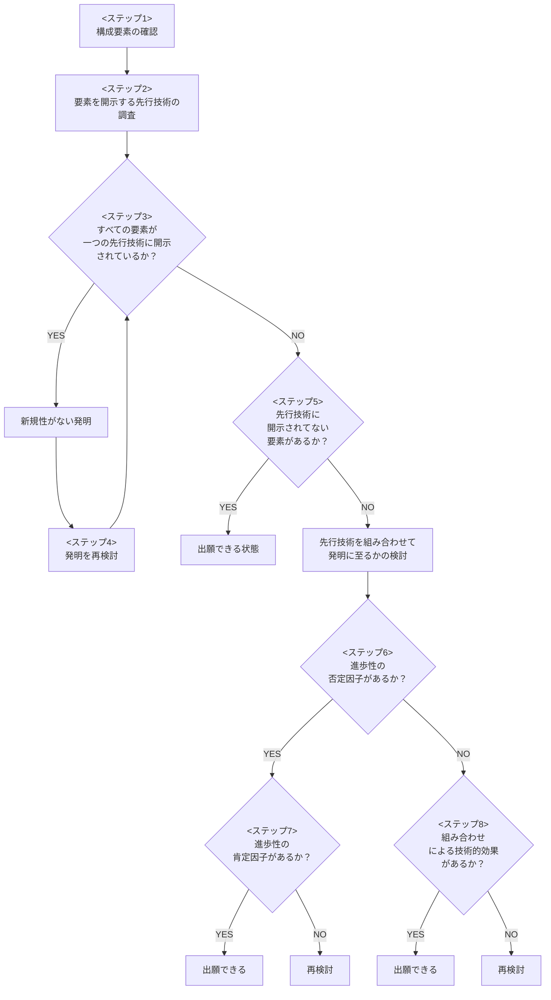

# Note

---

## 発明とは

自然法則を利用した技術的思想の創作のうち高度なもの（特許法第2条第1項）

### 種類
- **物の発明** - 装置、システム、組成物、プログラム等
- **方法の発明** - 処理または操作の組み合わせ
  - 単純方法の発明（測定方法、制御方法など）
  - 物を生産する方法の発明

### 発明に該当しないもの
- 自然法則自体（万有引力の法則など）
- 人為的な取り決め（ゲームのルール、計算方法など）
- 単なる発見（天然物の発見など）
- 技術的思想でないもの（芸術作品、情報の単なる提示など）

### 発明と認められるのに必要な要件
発明であるか + 記載要件 + 実体的要件 (新規性, 進歩性)

---

## 発明であるか

### 発明の成立要件（4つすべてを満たす必要あり）
1. **自然法則を利用** - 物理法則、化学法則、生物学的法則など
2. **技術的思想** - 知識として第三者に伝達できる客観性があること
3. **創作** - 新しく作り出したものであること（発見とは異なる）
4. **高度** - 実用新案の「考案」と区別するための要件

### 補足 - ソフトウェア・ビジネス関連発明の判断基準
ソフトウェアやビジネス方法が「発明」として認められるには、**ハードウェア資源を用いて具体的に実現**されている必要がある

- **発明に該当する例**
  - コンピュータによる情報処理がハードウェア資源（CPU、メモリ、通信装置等）を用いて具体的に実現
  - インターネット通信による情報入手（光信号や電流による作用を利用）
  - センサーやアクチュエータと連携した制御方法
- **発明に該当しない例**
  - 人間が行う抽象的なビジネス手法そのもの
  - 単なるアルゴリズムや数学的方法
  - 情報の単なる提示（データ構造のみの提示など）

---

## 記載要件

特許出願時に提出する書類と、その書類が満たすべき要件

### 出願書類
| 書類 | 内容 |
|------|------|
| 願書 | 出願人、発明者等の情報 |
| 特許請求の範囲 | 保護を求める発明の範囲（クレーム） |
| 明細書 | 発明の詳細な説明 |
| 要約書 | 発明の概要（技術情報として公開用） |
| 図面 | 必要に応じて添付 |

### 明細書の構成
1. 発明の名称
2. 技術分野
3. 背景技術（従来の技術）
4. 発明が解決しようとする課題
5. 課題を解決するための手段
6. 発明の効果
7. 図面の簡単な説明
8. 発明を実施するための形態（実施例）

### 記載要件（5つ）
| 要件 | 内容 | 拒絶理由 |
|------|------|----------|
| **実施可能要件** | 当業者が実施できる程度に明細書に記載されているか | 36条4項1号 |
| **サポート要件** | 請求項の発明が明細書に記載された範囲内か | 36条6項1号 |
| **明確性要件** | 請求項の記載が明確か | 36条6項2号 |
| **簡潔性要件** | 請求項の記載が簡潔か | 36条6項3号 |
| **単一性要件** | 一出願に含まれる発明が単一性を満たすか | 37条 |

### 補足 - 発明を考える際のポイント
- **課題と効果の対応** - 課題に対して効果が論理的に対応していること
- **実施例の充実** - 請求項の範囲をカバーする十分な実施例があること
- **用語の統一** - 明細書と請求項で同じ用語を使用すること

---

## 実体的要件

### 新規性（29条1項）
出願前に公知でないこと。発明を構成する `構成要素` と `構成要素どうしの関係` が先行技術と同一でないこと。

#### 新規性の判断
- 請求項の発明と先行技術を対比し、すべての構成要素が一致するか確認
- 構成要素が同じでも、関係が異なれば新規性あり
  - 例：スプレーの取り付け位置、ローラの取り付け角度

#### 新規性喪失の例外（30条）
以下の場合、公開から1年以内の出願であれば新規性喪失の例外適用が可能
- 自ら論文発表、学会発表した場合
- 自ら製品を販売した場合

#### 新規性が否定される場合
- 構成要素の組み合わせがすでに知られている
- 構成要素どうしの関係に違いがない
- 先行技術の上位概念・下位概念に含まれる

### 進歩性（29条2項）
当業者が先行技術に基づいて容易に発明できたかどうか

#### 進歩性が否定される場合（容易に発明できた）
| 類型 | 説明 |
|------|------|
| 動機づけあり | 先行技術に組み合わせの示唆がある |
| 技術分野の関連性 | 先行技術同士の技術分野が近い |
| 課題の共通性 | 先行技術同士が同じ課題を解決 |
| 作用・機能の共通性 | 先行技術同士が同じ作用を持つ |
| 設計変更 | 当業者の通常の創作能力の範囲内 |
| 寄せ集め | 組み合わせが新たな効果を生じない |

#### 進歩性が肯定される場合（容易に発明できない）
| 類型 | 説明 |
|------|------|
| 有利な効果 | 先行技術から予測できない顕著な効果がある |
| 阻害要因 | 先行技術に組み合わせを妨げる記載がある |
| 技術的困難性 | 組み合わせに技術的な困難を伴う |
| 異なる技術分野 | 先行技術同士の技術分野が遠い |

### 補足 - 新規性・進歩性を生み出す工夫パターン
発明の構成要素を工夫することで新規性・進歩性を確保できる場合がある

| パターン | 説明 |
|----------|------|
| 付加 | 新たな構成要素を追加する |
| 置換 | 構成要素を別のものに置き換える |
| 除去 | 構成要素を削除して簡素化する |
| 形態変更 | 構成要素の形状や配置を変更する |
| 数量変更・分割 | 構成要素の数を変える、分割する |
| 共通化・合体 | 複数の構成要素を一体化する |

---

## 新規発明の検討手順

### Step 0: 発明のアイデアを整理する

#### 1. 課題を見つける
- 既存技術の問題点、不便な点は何か
- ユーザーが困っていることは何か
- 業界で解決されていない技術的課題は何か

#### 2. 課題に対する解決手段を検討する
- その課題をどのように解決するか
- 解決手段は技術的なものか（自然法則を利用しているか）

#### 3. 発明を構成要素に分解する
- `構成要素`：発明を構成する部品、処理、データ等
- `構成要素どうしの関係`：接続関係、処理順序、制御関係等

### Step 1-8: 先行技術調査と出願可否判断

### 各ステップの詳細

| ステップ | 作業内容 |
|----------|----------|
| 1 | 発明の構成要素をリストアップし、請求項の形で整理する |
| 2 | J-PlatPat等で各構成要素を開示する先行技術を調査する |
| 3 | 一つの先行技術にすべての構成要素が開示されていれば新規性なし |
| 4 | 新規性がない場合、構成要素の工夫パターン（付加・置換・除去等）で再検討 |
| 5 | 複数の先行技術を組み合わせても開示されない要素があれば出願可能 |
| 6 | 先行技術の組み合わせに動機づけ等の否定因子があるか確認 |
| 7 | 否定因子がある場合、有利な効果等の肯定因子で覆せるか検討 |
| 8 | 否定因子がない場合でも、組み合わせによる技術的効果を確認 |

### 先行技術調査の方法

#### J-PlatPat での検索
| 検索対象 | 説明 |
|----------|------|
| 公開特許公報 | 出願から1年6ヶ月後に公開される（審査中） |
| 特許公報 | 特許として登録されたもの |

#### 分類を使った検索
| 分類 | 説明 |
|------|------|
| IPC | 国際特許分類（世界共通） |
| FI | 日本独自の詳細分類（IPCを細分化） |
| Fターム | 技術的観点による多面的分類 |

### 補足 - ソフトウェア発明の構成要素
ソフトウェア・コンピュータ制御系の発明では、以下の観点で構成要素を整理する

| 観点 | 例 |
|------|------|
| 処理の時系列 | ステップA→ステップB→ステップCの順序 |
| 条件分岐 | 〜の場合に〜する |
| データの紐付け | データAとデータBを関連付けて記憶 |
| 通信手段 | サーバとクライアント間で〜を送受信 |
| ハードウェア制御 | センサーからの入力に基づきアクチュエータを制御 |

---

## その他

### パテントマップ
特許情報を可視化・分析するためのツール

| 種類 | 用途 |
|------|------|
| 技術動向マップ | 出願件数の推移、技術分野の変遷を把握 |
| 出願人マップ | 競合他社の出願動向を分析 |
| 課題-解決手段マップ | 技術的な空白領域（ホワイトスペース）を発見 |

### ビジネスモデル特許
ビジネス方法をコンピュータやネットワークで実現した発明

- ICT技術を用いて具体的に実現されていることが必要
- 単なるビジネスアイデアは特許にならない
- 例：電子商取引の決済システム、オンライン予約システム

### IPランドスケープ
経営戦略に知的財産情報を活用する分析手法

- 自社・競合の特許ポートフォリオ分析
- M&Aや事業提携の判断材料
- 研究開発の方向性決定に活用
